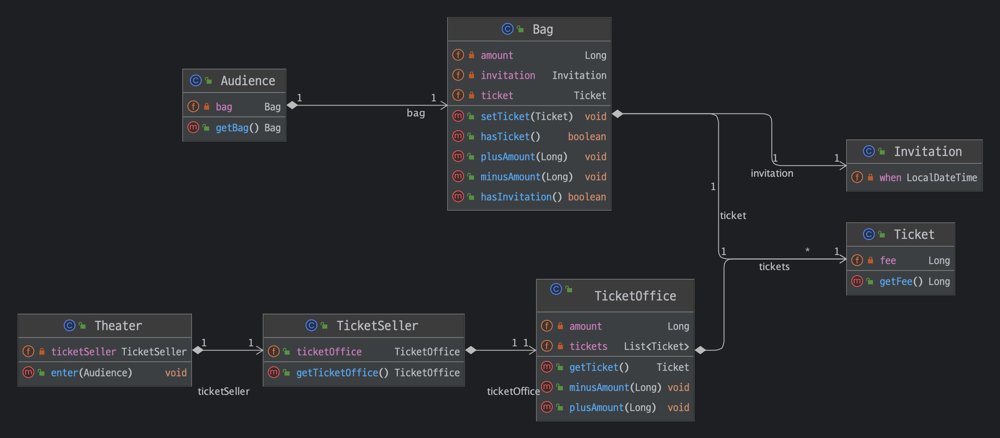

# Chapter 01. 객체, 설계

어떤 분야든 초기 단계에서는 아무것도 없는 상태에서 이론을 정립 하기보다는 실무를 관찰한 결과를 바탕으로 이론을 정립하는 것이 최선

- 소프트웨어 설계
- 소프트웨어 유지보수

개념은 지루하고 이론은 따분하다. 개발자는 구체적인 코드를 만지며 손을 더럽힐 때 가장 많은 것을 얻어가는 존재다.

# 개념 정리
> 모든 소프트웨어와 모듈에는 세 가지 목적이 있다. 첫 번째 목적은 실행 중에 제대로 동작하는 것이다. 이것은 모듈의 존재 이유라고 할 수 있다. 두 번째 목적은 변경을 위해 존재하는 것이다. 대부분의 모듈은 생명주기 동안 변경되기 때문에 간단한 작업만으로도 변경이 가능해야 한다. 변경하기 어려운 모듈은 제대로 동작하더라도 개선해야 한다. 모듈의 세 번째 목적은 코드를 읽는 사람과 의사소통하는 것이다. 모듈은 특별한 훈련 없이도 개발자가 읽고 이해할 수 있어야 한다. 읽는 사람과 의사소통할 수 없는 모듈은 개선해야 한다. [Martin02]
> 
> <클린 소프트웨어: 에자일 원칙과 패턴, 그리고 실천 방법> 로버트 마틴(Robert C. Martin)

모든 모듈(프로그램을 구성하는 임의의 요소)은

- 제대로 실행돼야 하고
- 변경이 용이해야 하며
- 이해하기 쉬워야 한다

## 설계 개선하기

- 의도를 정확하게 의사소통 해야함
- 세부사항을 모두 알 필요는 없음
- 자율적인 존재로 만들자

### 변경에 취약한 코드

- 의존성(dependency) 이 과함 = 결합도(coupling) 이 높음 ⇒ 변경에 취약
- 애플리케이션의 기능을 구현하는 데 필요한 최소한의 의존성만 유지하고 불필요한 의존성을 제거해야 함

### 캡슐화(encapsulation)와 응집도(cohesion)

- 개념적이나 물리적으로 객체 내부의 세부적인 사항을 감춤
- 낮은 결합도, 변경하기 쉬운 객체
- 객체를 인터페이스와 구현으로 나누고 인터페이스만을 공개
- 응집도(Cohesion) 가 높다 = 밀접하게 연관된 작업만을 수행하고 연관성 없는 작업은 다른 객체에게 위임하는 객체
    - 객체 스스로 자신의 데이터를 책임져야 함
    - 객체는 자신의 데이터를 스스로 처리하는 자율적인 존재
- 객체 내부의 상태를 캡슐화하고 객체 간에는 오직 메세지를 통해서만 상호작용

## 객체지향 설계

- 외부의 간섭을 최대한 배제하고 메세지를 통해서만 협력하는 자율적인 객체들의 공동체를 만드는 것

### 절차지향과 객체지향

절차지향적 프로그래밍(Procedural programming)

- 프로세스와 데이터를 별도의 모듈에 위치시키는 방식
- 모든 처리를 하나의 클래스가 하고 나머지는 수동적인 데이터 역할만을 함
- 변경에 취약

객체지향 프로그래밍(Object-Oriented Programming)

- 데이터와 프로세스가 동일한 모듈 내부에 위치
- 캡슐화로 의존성을 적절히 관리하여 객체 사이의 결합도를 낮춤
- 변경에 유연 → 한번에 하나의 클래스만 변경

### 책임의 이동(shift of responsibility) [Shalloway01]

하나의 기능을 완성하는데 필요한 책임을 여러 객체에 분산

**결합도** 높은 불필요한 세부사항을 객체 내부로 **캡슐화**하여 객체의 **자율성**을 높이고 **응집도** 높은 객체들의 공동체를 창조하여 서로 협력하도록 최소한의 의존성만 남김

### 설계가 왜 필요한가
> 설계란 코드를 배치하는 것이다. [Metz12]

좋은 설계란?

- 올바르게 동작
- 변경되는 요구사항을 쉽게 수용할 수 있는 유연한 코드
- 객체 사이의 의존성을 적절하게 관리하는 설계가 필요함
- 설계는 균형의 예술이다
- 훌륭한 설계는 적절한 트레이드오프의 결과물
    - 모든 사람들을 만족시킬 수 있는 설계를 만들 수는 없음
    - 균형을 맞추는 것이 중요함

훌륭한 객체지향 설계란?

- 소프트웨어를 구성하는 모든 객체들이 자율적으로 행동하는 설계
- 뇌를 속여서 현실세계의 상식과 코드속 객체를 분리시켜라

# 예시 코드 : 티켓 판매 애플리케이션

요구사항

- 추첨을 통해 선정된 관람객에게 공연을 무료로 관람할 수 있는 초대장을 발송
- 이벤트에 당첨된 관람객 → 초대장을 티켓으로 교환
- 이벤트에 당첨되지 않은 관람객 → 티켓을 구매
- 관람객 입장 전 이벤트 당첨 여부를 확인

## feature: 최초 구현 ([commit link](https://github.com/bithumb-study/study-object/commit/b941e6d0ef64650dd4a858c90e40279241c1b62c))

### 문제점: 예상을 빗나가는 코드

- 이해하기 어려움
    - 현실세계의 예상을 벗어나 동작하고 있으며
    - 하나의 클래스나 메소드에서 너무 많은 세부사항을 다루고 있음
- 변경이 어려움
    - `Audience` , `TicketSeller` 를 변경할 경우 `Theater` 도 함께 변경해야함

## fix: 결합도 낮추기 [commit1 link](https://github.com/hyun-sun/study-object/commit/3a13e5eb5ec6d74f011ad658cc56c209c87ff5c5), [commit2 link](https://github.com/hyun-sun/study-object/commit/396fbd69a34c83df0bae3d6fb03d90f9c3ef281d)

- `Theater` 가 오직 `TicketSeller` 의 interface 에만 의존하도록 변경
- `TicketSeller` 와 `Audience` 의 결합도 낮춤

### 결과

- `Audience` 나 `TicketSeller` 의 내부 구현을 변경하더라도 `Theater` 를 함께 변경할 필요가 없어짐
- 객체의 자율성을 높이는 방향으로 설계를 개선 → 이해하기 쉽고 유연한 설계

## fix: 한번 더 개선하기 [commit](https://github.com/hyun-sun/study-object/commit/4d0154c535ecaa5284c7b7504a12eeb03ea6ed0f)

### 결과
- `TicketOffice` 의 자율성은 올라갔지만 전체 설계 관점에서의 결합도 상승 : 새로운 의존성 추가
- 트레이드오프 포인트